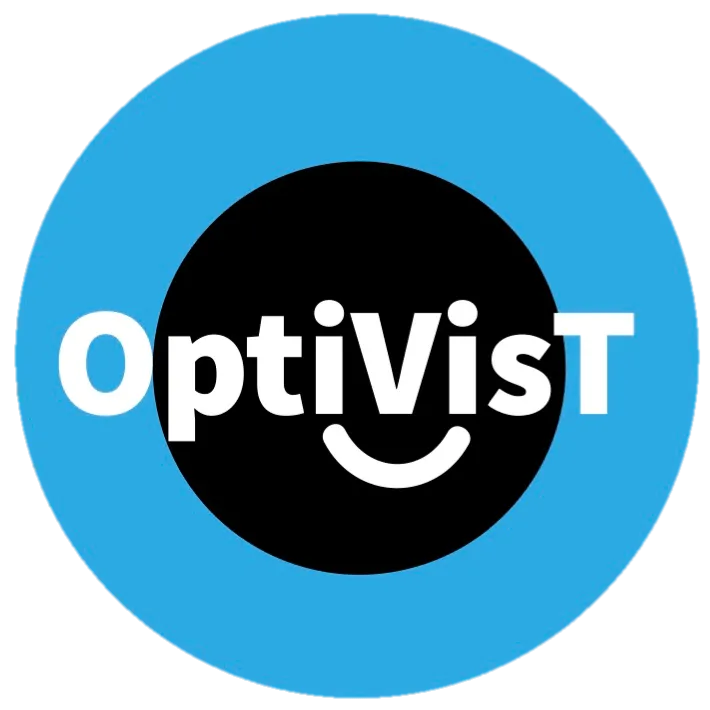

# Point-SPV: End-to-End Enhancement of Object Recognition in Simulated Prosthetic Vision using Synthetic Viewing Points

This repository contains the code for the deep learning model and behavrioral data anaylsis from the manuscript "Point-SPV: End-to-End Enhancement of Object Recognition in Simulated Prosthetic Vision using Synthetic Viewing Points."


The repository for executing the behavioral gaze-contingent experiment:

[https://github.com/LEO-UMCG/SPV-Gaze-Contingency](https://github.com/LEO-UMCG/SPV-Gaze-Contingency)


For citations please use the following [publication](https://doi.org/10.3389/fnhum.2025.1549698):

```
Nejad, Ashkan, Burcu Küçükoǧlu, Jaap de Ruyter van Steveninck, Sandra Bedrossian, Joost Heutink, Gera A. de Haan, Frans W. Cornelissen, and Marcel van Gerven. "Point-SPV: end-to-end enhancement of object recognition in simulated prosthetic vision using synthetic viewing points." Frontiers in Human Neuroscience 19 (2025): 1549698. https://doi.org/10.3389/fnhum.2025.1549698
```

## Remark and Acknowledgement

This project has received funding from the European Union’s Horizon 2020 research and innovation programme under the Marie Sklodowska-Curie grant agreement No 955590.

    

